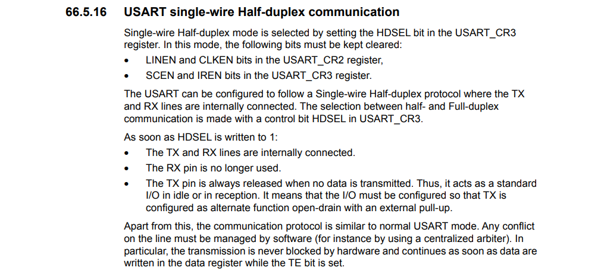

# Project Eve

<div align="center">


<br>

[Code](Code/) 
| [Documentation](Documents/) 
| [Liens utiles](Documents/Liens_utiles.md) 
| [Journal](Journal/ReadMe.md)
| [Bilan des présentations](Présentation/ReadMe.md)

</div>


## Introduction

Vous vous situez sur le Github d'Eve (anciennement Robourt). C'est un projet de bras robotique six axes réalisé par des étudiants de l'ENSEA. Vous pourrez trouver ici la documentation, le guide d'utilisation, le journal de bord (et autres documents connexes) pour comprendre notre projet. Nous vous souhaitons une bonne lecture !

> You are in the Github of Eve (formely Robourt). This is a project of a six-axis robot arm project by students at ENSEA. Here you can find here documentation, user guide, logbook (and other related documents) to help you understand our project. We hope you enjoy reading! The rest of the text will be in French exclusively.


### Table des matières


1. [Partie Software](#partie-software)
2. [Partie Hardware et intégration](#partie-hardware-et-intégration)
3. [Guide d'utilisation](#guide-dutilisation)
4. [Annexes](#annexes)


## Partie-Software

### Contrôle des servos moteurs avec Dynamixel 2.0

Dans le cadre du projet, les servomoteurs servent à actionner la pince et à gérer certains axes de rotation du robot ne nécessitant pas beaucoup de couple. Il y a un total de 4 servomoteurs, tous utilisant le protocole Dynamixel 2.0 et connectés en série. Nous utilisons une connexion UART en mode half-duplex avec notre microprocesseur.

#### Connexion UART Half-Duplex

Il est nécessaire de configurer le GPIO utilisé pour l'UART en mode open drain avec une résistance de pull-up pour que le half-duplex puisse fonctionner.
<div align="center">
<br>
 </br>
Exrtait du reference manual </br>
</br> 
</div>

Pour envoyer et recevoir des données, il est nécessaire de préciser si l'on transmet ou reçoit pour éviter les conflits sur le fil unique utilisé pour l'UART. Pour cela, on utilise les fonctions HAL correspondantes HAL_HalfDuplex_EnableTransmitter() et HAL_HalfDuplex_EnableReceiver().

#### Protocole Dynamixel 2.0

La majorité des informations ont été obtenues sur cette page https://emanual.robotis.com/docs/en/dxl/protocol2/


### Contrôle des steppers par la TMC2590

#### Connexion SPI

On doit configurer SPI1 avec 3 ports MISO/MOSI & CLK (configurable dans IOC) et un Chip Select Not. Pour asservir un driver, il faut mettre son bit en état bas (ce qui a été fait dans l'initialisation du code).
Le but est de transmettre un mot en bits contenant l'ordre (angles en degré) et la configuration du TMC2590. 

Pour cela nous avons la possibilité d'écrire dans 5 registres différents

<div align="center">
<br>
 </br>
Registres </br>
</br> 
</div>

<div align="center">
<br>
 </br>
Formats des registres </br>
</br> 
</div>

On remarque alors que ce sont les 2 bits de poids fort qui détermine dans quels registres nous écrivons.  Nous modifierons uniquement 2 registres : DRVCTRL & DRVCON. Nous laisserons les autres registres aux valeurs par défaut (mais nous pourrons les configurer à besoin si nécessaire).

##### Registre DRVCTRL

C'est le registre qui fait décide du courant à envoyer dans le stepper.

<div align="center">
<br>
 </br>
Formats du registre DRVCTRL en mode SPI </br>
</br> 
</div>

Pour commander les steppers, il faut leur envoyer des amplitudes de courant. Il faut donc trouver une relation entre les angles et le courant. Nous avons trouvé une relation entre les deux avec un sinus. __A expliquer__

On sait que le courant correspond à la partie entière du sinus(angle) * 255. On stocke ensuite toutes ces données dans un tableau qui fait des ordres de 0 à 90°. Comme le sinus est périodique, cela suffira à faire n'importe quel calcul de sinus/cosinus.

##### Registre DRVCONF

C'est le registre qui configure le driver.

<div align="center">
<br>
 </br>
Formats du registre DRVCONF </br>
</br> 
</div>

C'est ici qu'il faut modfier le bit pour désactiver l'interface STEP/DIR. Pour choisir le mode SPI il faut que le bit SDOFF soit égal à 1. Sinon, l'interface choisie sera STEP/DIR.

Il faudra aussi modifier les bits 4&5 pour configurer une partie de la réponse (voir image suivante).

##### Les registres pour la réponse

Nous pouvons aussi récupérer des informations à l'aide d'autres registres uniquement en lecture.

<div align="center">
<br>
 </br>
Formats des registres de réponse </br>
</br> 
</div>


Nous avons donc configuré les registres avec les paramètres suivants :


```c
	phtmc2590->drvCtrlRegister 			= 0x00000; // No Current
	phtmc2590->chopConfRegister			= 0b10011000000000001111; // 100 10
	phtmc2590->smartEnRegister 			= 0b10100000000000000000; // 101 0
	phtmc2590->stallGuardCtrlRegister 	= 0b11000000000000011111;//0xD001F; // 110 1---- 11111
	phtmc2590->drvConfRegister 			= 0b11100000011110110000;//0xE0480; // 1110 0000 0100 1000 0000
```

#### Explication du code

Nous sommes passé par une structure
Le code de commande pour la TMC2590 est séparé en plusieurs parties : 

* tmc2590_Init : Permet d'initialiser les registres du driver et de le mettre prêt au fonctionnement. Pour le moment, l'activation du signal nCS se fait à ce moment mais par la suite, il sera fait dans une autre fonction qui décidera avec quel stepper on communique.


```c
void tmc2590_Init(TMC2590_HandleTypeDef *phtmc2590, SPI_HandleTypeDef *hspi, GPIO_TypeDef *gpioPortNCS, uint16_t gpioPinNCS, GPIO_TypeDef *gpioPortDrvEnN, uint16_t gpioPinDrvEnN){
	uint8_t pData[3];
	phtmc2590->hspi = hspi;
	phtmc2590->gpioPinNCS = gpioPinNCS;
	phtmc2590->gpioPortNCS = gpioPortNCS;
	phtmc2590->gpioPinDrvEnN = gpioPinDrvEnN;
	phtmc2590->gpioPortDrvEnN = gpioPortDrvEnN;

	tmc2590_SetPowerEnable(phtmc2590, SET);
	tmc2590_SetnCS(phtmc2590, SET);

	phtmc2590->drvCtrlRegister 			= 0x00000; // No Current
	phtmc2590->chopConfRegister			= 0b10011000000000001111; // 100 10
	phtmc2590->smartEnRegister 			= 0b10100000000000000000; // 101 0
	phtmc2590->stallGuardCtrlRegister 	= 0b11000000000000011111;//0xD001F; // 110 1---- 11111
	phtmc2590->drvConfRegister 			= 0b11100000011110110000;//0xE0480; // 1110 0000 0100 1000 0000

	tmc2590_SetTxBufferInt32(phtmc2590, phtmc2590->drvCtrlRegister);
	tmc2590_TransmitReceive(phtmc2590, TMC2590_CMD_SIZE);
	tmc2590_SetTxBufferInt32(phtmc2590, phtmc2590->chopConfRegister);
	tmc2590_TransmitReceive(phtmc2590, TMC2590_CMD_SIZE);
	tmc2590_SetTxBufferInt32(phtmc2590, phtmc2590->smartEnRegister);
	tmc2590_TransmitReceive(phtmc2590, TMC2590_CMD_SIZE);
	tmc2590_SetTxBufferInt32(phtmc2590, phtmc2590->stallGuardCtrlRegister);
	tmc2590_TransmitReceive(phtmc2590, TMC2590_CMD_SIZE);
	tmc2590_SetTxBufferInt32(phtmc2590, phtmc2590->drvConfRegister);
	tmc2590_TransmitReceive(phtmc2590, TMC2590_CMD_SIZE);

	HAL_TIM_Base_Start_IT(&htim2);

}
```
<div align="center">
Code tmc2590_Init </br>
</br> 
</div>


Entrées : 
* Structure TMC2590
* Pointeur SPI
* Signal nCS
* Pin nCS
* Signal DRVENN
* Pin DRVENN


* sendOrderStepper : 


```c
int sendOrderStepper(int inputOrder){

	/*
	 * We need to put in input how much we want to turn in degrees and what stepper we want to move
	 * For the moment, we have only one stepper but with nCS signal, we will be able to change with
	 * stepper we want to communicate
	 */
	int polarity = (inputOrder>0);
	int order = (int) abs(inputOrder)*142.2;
	int indice = 0;
	while (indice != order){
		uint32_t stateInterruption = HAL_GPIO_ReadPin(GPIOC, GPIO_PIN_8);
		if (stateInterruption != 0){
			return 0;
		}
		if(perioedElapsed_IT){
				if(index_sin_loop < 256){
					currentCoilA = sinTable[index_sin_loop];
					currentCoilB = sinTable[256-index_sin_loop];
					polarityCoilA = polarity;
					polarityCoilB = 1;
				}
				else if(index_sin_loop < 512){
					currentCoilA = sinTable[512-index_sin_loop];
					currentCoilB = sinTable[index_sin_loop-256];
					polarityCoilA = polarity;
					polarityCoilB = 0;
				}
				else if(index_sin_loop < 768){
					currentCoilA = sinTable[index_sin_loop-512];
					currentCoilB = sinTable[768-index_sin_loop];
					polarityCoilA = 1 - polarity;
					polarityCoilB = 0;
				}
				else{
					currentCoilA = sinTable[1024-index_sin_loop];
					currentCoilB = sinTable[index_sin_loop-768];
					polarityCoilA = 1 - polarity;
					polarityCoilB = 1;
				}
				index_sin_loop = (index_sin_loop+1)%1024;
				indice++;

				drvCtrlCommand = (polarityCoilA << 17) | (currentCoilA << 9) | (polarityCoilB << 8) | (currentCoilB << 0);
				tmc2590_SetTxBufferInt32(&htmc2590, drvCtrlCommand);
				tmc2590_TransmitReceive(&htmc2590, TMC2590_CMD_SIZE);
				perioedElapsed_IT = 0;
			}
	}
	return 1;

```

<div align="center">
Code sendOrderStepper </br>
</div>

### ROS 2

Il y a deux manières de faire avec ROS2 :
* ROS2 contrôle tout : le contrôle, la gestion des ressources et les calculs => Utilisation de [ROS_Control](https://github.com/ros-controls/control.ros.org) (Méthode 1)
* ROS2 ne fait presque rien : Il transmet simplement les données d'un point A à un point B (Méthode 2)


<div align="center">
<br>
 </br>
Schéma de la méthode 1 </br>
</br> 
</div>

Le problème avec la méthode 1, c'est que comme tout est géré par ROS, on n'utilise pas la STM32 et donc notre projet d'électronique n'a plus de sens. Autre problème de la méthode 1, c'est l'utilisation de C++ pour faire le code qui est un langage POO assez complexe à prendre en main alors que tous les packages étaient actuellement fait sous python.


La 2e méthode revient à créer une entrée où l'on mettra les ordres (des angles pour différents moteurs) puis tout est envoyé par UART à la STM32 qui effectue l'envoi des ordre pour chacun des moteurs. 

C'est plutôt la 2e méthode qui est envisagée étant donnée que le groupe de 3e année ont réalisé une simulation qui permet de passer de coordonnées x,y & z en données d'angles pour chaque moteur. On aurait alors à transmettre ces données à la carte STM32 (UART) qui s'occuperait de la partie commande des moteurs.

Il faut définir le protocole de communication entre les deux appareils en s'inspirant du Dynamixel.

## Partie Hardware et intégration

### Cahier des charges - Matériel


* TMC2590
* 17hs19-2004s
* XL320 (x2)
* XL430 w250 (x2)
* 23HS8430
* 23hS2442B Nema 23
* STM32 L412
* BU33SD5WG-TR


<div align="center">

</div>

## Annexes


Diagramme de Gantt

<div align="center">
 </br>
</div>
