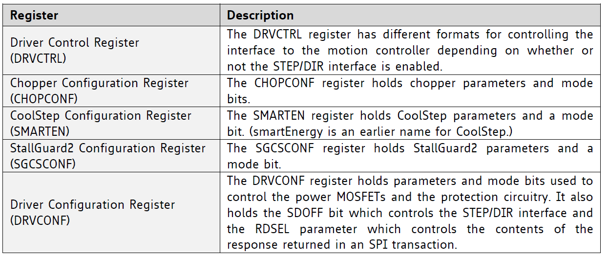
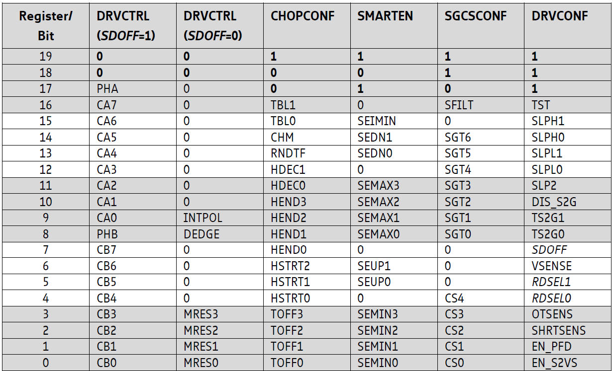
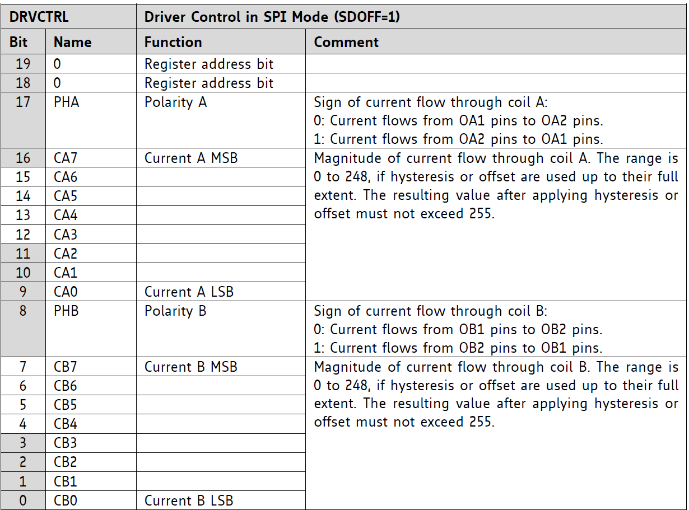
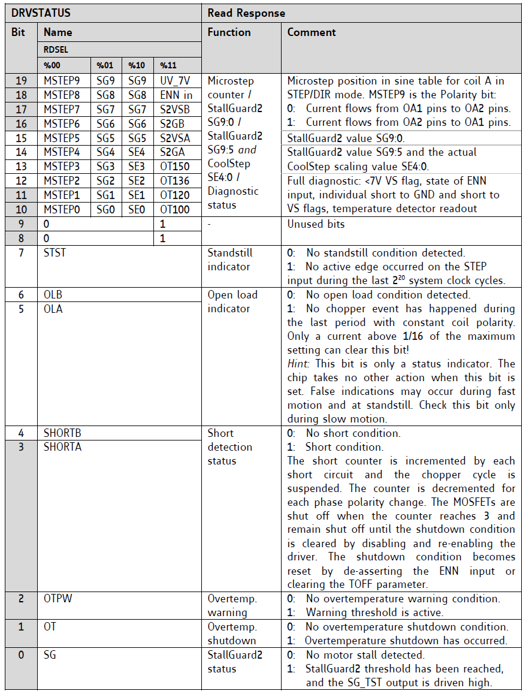

# Project Eve

 

[Code](Code/) 
| [Documentation](Documents/) 
| [Liens utiles](Documents/Liens_utiles.md) 
| [Journal](Journal/ReadMe.md)
| [Bilan des présentations](Présentation/ReadMe.md)

## Introduction

Vous vous situez sur le Github d'Eve (anciennement Robourt). C'est un projet de bras robotique six axes réalisé par des étudiants de l'ENSEA. Vous pourrez trouver ici la documentation, le guide d'utilisation, le journal de bord (et autres documents connexes) pour comprendre notre projet. Nous vous souhaitons une bonne lecture !

> You are in the Github of Eve (formely Robourt). This is a project of a six-axis robot arm project by students at ENSEA. Here you can find here documentation, user guide, logbook (and other related documents) to help you understand our project. We hope you enjoy reading! The rest of the text will be in French exclusively.

### Table des matières

1. [Partie Software](#partie-software)
2. [Partie Hardware et intégration](#partie-hardware-et-intégration)
3. [Guide d'utilisation](#guide-dutilisation)
4. [Annexes](#annexes)

## Partie-Software

### Contrôle TMC2590

#### Connexion SPI

On doit configurer SPI1 avec 3 ports MISO/MOSI & CLK (configurable dans IOC) et un Chip Select Not. Pour asservir un driver, il faut mettre son bit en état bas (ce qui a été fait dans l'initialisation du code).
Le but est de transmettre un mot en bits contenant l'ordre (angles en degré) et la configuration du TMC2590. 

Pour cela nous avons la possibilité d'écrire dans 5 registres différents

 
  
Registres  
  

 
  
Formats des registres  
  

On remarque alors que ce sont les 2 bits de poids fort qui détermine dans quels registres nous écrivons.  Nous modifierons uniquement 2 registres : DRVCTRL & DRVCON. Nous laisserons les autres registres aux valeurs par défaut (mais nous pourrons les configurer à besoin si nécessaire).

##### Registre DRVCTRL

C'est le registre qui fait décide du courant à envoyer dans le stepper.

 
  
Formats du registre DRVCTRL en mode SPI  
  

Pour commander les steppers, il faut leur envoyer des amplitudes de courant. Il faut donc trouver une relation entre les angles et le courant. Nous avons trouvé une relation entre les deux avec un sinus. __A expliquer__

On sait que le courant correspond à la partie entière du sinus(angle) * 255. On stocke ensuite toutes ces données dans un tableau qui fait des ordres de 0 à 90°. Comme le sinus est périodique, cela suffira à faire n'importe quel calcul de sinus/cosinus.

##### Registre DRVCONF

C'est le registre qui configure le driver.

 
  
Formats du registre DRVCONF  
  

C'est ici qu'il faut modfier le bit pour désactiver l'interface STEP/DIR. Pour choisir le mode SPI il faut que le bit SDOFF soit égal à 1. Sinon, l'interface choisie sera STEP/DIR.

Il faudra aussi configurer les bits 4&5 pour pouvoir lire en réponse la position 

##### Les registres pour la réponse

Nous devons aussi récupérer des informations à l'aide d'autres registres uniquement en lecture.

 
  
Formats des registres de réponse  
  

__A continuer__

### ROS 2

Il y a deux manières de faire avec ROS2 :
* ROS2 fait tout : le contrôle, la gestion des ressources et les calculs => Utilisation de [ROS_Control](https://github.com/ros-controls/control.ros.org) (Méthode 1)
* ROS2 ne fait presque rien : Il transmet simplement les données d'un point A à un point B (Méthode 2)

 
  
Schéma de la méthode 1  
  

Le problème avec la méthode 1, c'est que comme tout est géré par ROS, on n'utilise pas la STM32 et donc notre projet d'électronique n'a plus de sens. Autre problème de la méthode 1, c'est l'utilisation de C++ pour faire le code qui est un langage POO assez complexe à prendre en main alors que tous les packages étaient actuellement fait sous python.

La 2e méthode revient à créer une entrée où l'on mettra les ordres (des angles pour différents moteurs) puis tout est envoyé par UART à la STM32 qui effectue l'asservissement de chacun des moteurs. 

C'est plutôt la 2e méthode qui est envisagée étant donnée que le groupe de 3e année ont réalisé une simulation qui permet de passer de coordonnées x,y & z en données d'angles pour chaque moteur. On aurait juste alors à transmettre ces données à la carte STM32 (UART) qui s'occuperait de la partie commande des moteurs.

## Partie Hardware et intégration

### Cahier des charges - Matériel

* TMC2590
* 17hs19-2004s
* XL320 (x2)
* XL430 w250 (x2)
* 23HS8430
* 23hS2442B Nema 23
* STM32 L412
* Quel régulateur ?

WIP

## Guide d'utilisation

WIP

## Annexes

WIP
